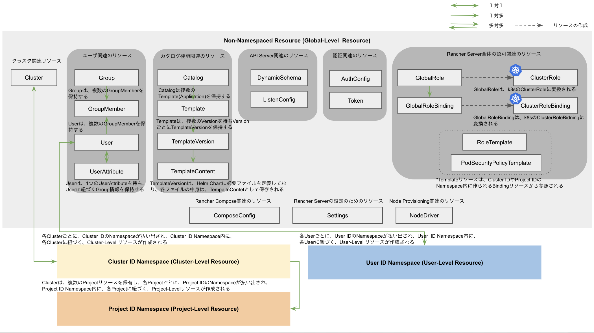
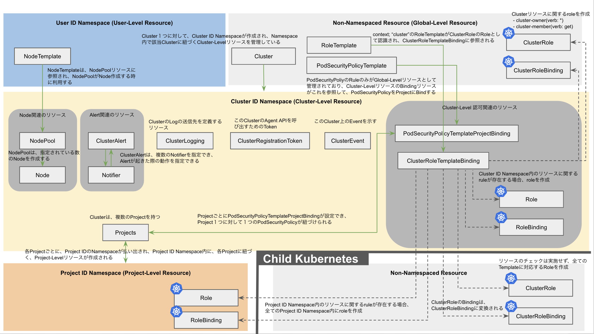
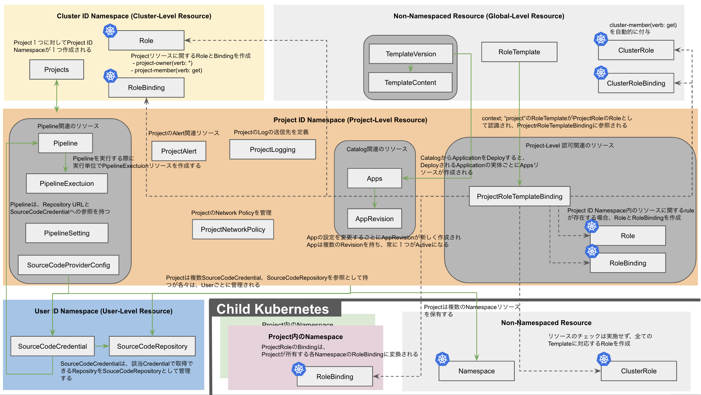
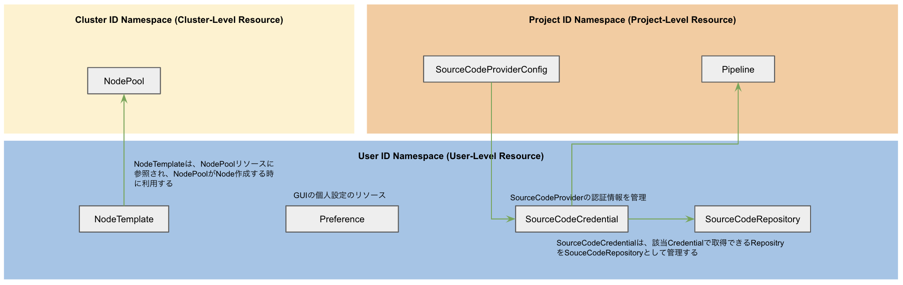

# RancherBook-samples/images

RancherによるKubernetes活用完全ガイド（Think IT Books）内の一部の図の元データになります。

## P339 図 14.4 Global-Level Resource

## P345 図 14.5 Cluster-Level Resource

## P349 図 14.6 Project-Level Resource

## P352 図 14.7 User-Level Resource

